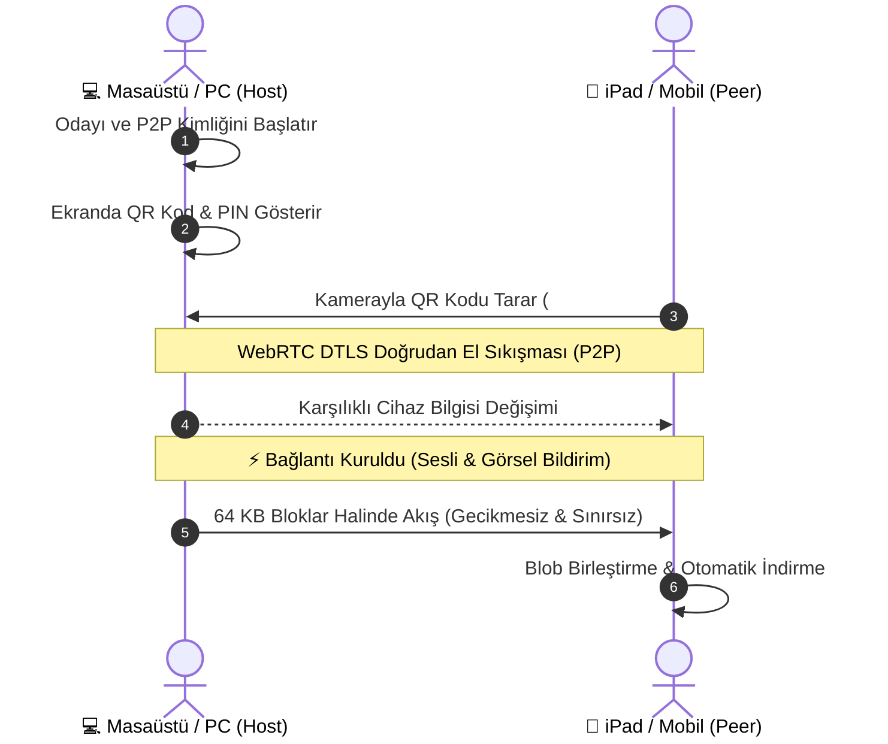

<div align="center">

# ⚡ AetherDrop Pro
**Ultra-Fast, Zero-Cloud, End-to-End Encrypted P2P Cross-Device Transfer**

[](https://aetherdrops.netlify.app/)

[](https://webrtc.org)
[](#)
[](LICENSE)

### 🌐 Canlı Uygulama: [https://aetherdrops.netlify.app/](https://aetherdrops.netlify.app/)

*iPad, iPhone, Android ve Bilgisayarlar arasında sıfır sunucu depolaması ve dosya boyutu sınırı olmaksızın, doğrudan ve uçtan uca şifreli dosya & metin aktarımı.*

[Canlı Uygulamayı Aç](https://aetherdrops.netlify.app/) • [Özellikler](#-özellikler) • [Nasıl Çalışır?](#-nasıl-çalışır) • [PWA Kurulumu](#-ipad--iphone-pwa-kurulumu) • [Yerel Geliştirme](#-yerel-geliştirme)

</div>

---

## 🌟 Öne Çıkan Özellikler

- **📱 Akıllı Cihaz Tespiti & Apple / Android Entegrasyonu:**
  - iPad (iPadOS), iPhone, Android, Mac ve Windows sistemlerini anında tespit eder.
  - Radar ekranında her cihaza özel parlayan neon ikonlar ve cihaz kimlikleri gösterilir.
- **⚡ Sınırsız Dosya Boyutu (WebRTC P2P DataChannel):**
  - Dosyalar hiçbir ara sunucuya yüklenmez; doğrudan iki cihaz arasında şifreli tünelden (*DTLS-SRTP*) akar.
  - **SCTP Backpressure Flow Control:** 1 GB+, 5 GB+ 4K videolar ve devasa arşivler tarayıcıyı kasmadan ve bellek çökmesi yaşatmadan 64 KB'lık akıllı bloklar halinde akar.
- **🔗 QR Kod & 6 Haneli PIN ile 1 Saniyede Eşleşme:**
  - Bilgisayarda açık olan QR kodu iPad veya telefon kamerasından okutun; cihazlar doğrudan birbirinin P2P kimliğine kilitlenir.
- **📋 Hızlı Metin, Link & Pano Senkronizasyonu:**
  - PC'den kopyalanan bir web bağlantısını veya notu iPad'e tek dokunuşla gönderin, kopyalayın veya Safari'de açın.
- **💎 Lüks Cyber / Apple Estetiği & Web Audio Ses Efektleri:**
  - Glassmorphism karanlık tema, etkileşimli radar dalgaları, canlı hız göstergesi (MB/s), kalan süre (ETA) ve resim önizlemeleri.
  - Web Audio API ile sıfır harici varlık yüküyle sentetik dokunsal ses bildirimleri ve konfeti kutlaması.
- **📲 PWA (Progressive Web App):**
  - iPad ve iPhone Safari'de *"Ana Ekrana Ekle"* yapıldığında adres çubukları olmadan tam ekran yerel bir iOS uygulaması gibi çalışır.

---

## 🔄 Nasıl Çalışır?



---

## 📱 iPad & iPhone PWA Kurulumu

1. iPad veya iPhone'unuzda Safari tarayıcısını açıp **[https://aetherdrops.netlify.app/](https://aetherdrops.netlify.app/)** adresine gidin.
2. Safari'nin alt menüsündeki **Paylaş** (`Share`) butonuna dokunun.
3. Listeden **"Ana Ekrana Ekle" (Add to Home Screen)** seçeneğini seçin.
4. Artık AetherDrop, ana ekranınızda bağımsız, tam ekran yerel bir Apple uygulaması olarak kullanılabilir.

---

## 🛠️ Yerel Geliştirme

```bash
# Depoyu klonlayın
git clone https://github.com/latryee/AetherDrop.git
cd AetherDrop

# Bağımlılıkları yükleyin
npm install

# Geliştirme sunucusunu başlatın
npm run dev

# Üretim derlemesi oluşturun
npm run build

# Derlemeyi önizleyin
npm run preview
```

---

## 🔒 Güvenlik & Gizlilik

- **Sıfır Depolama:** Hiçbir dosya, metin veya kullanıcı verisi sunucularda saklanmaz.
- **Uçtan Uca Şifreli:** Bütün veri akışı WebRTC'nin endüstri standardı **DTLS-SRTP** şifrelemesi ile korunur.

---

<div align="center">
Geliştirici: <b>latryee</b> • Canlı Uygulama: <a href="https://aetherdrops.netlify.app/">https://aetherdrops.netlify.app/</a> • MIT Lisansı
</div>
